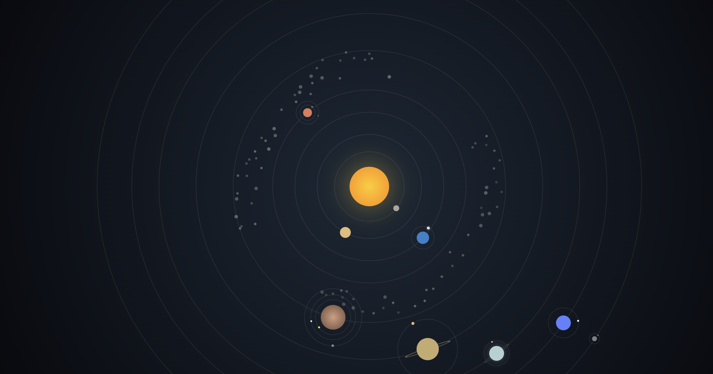
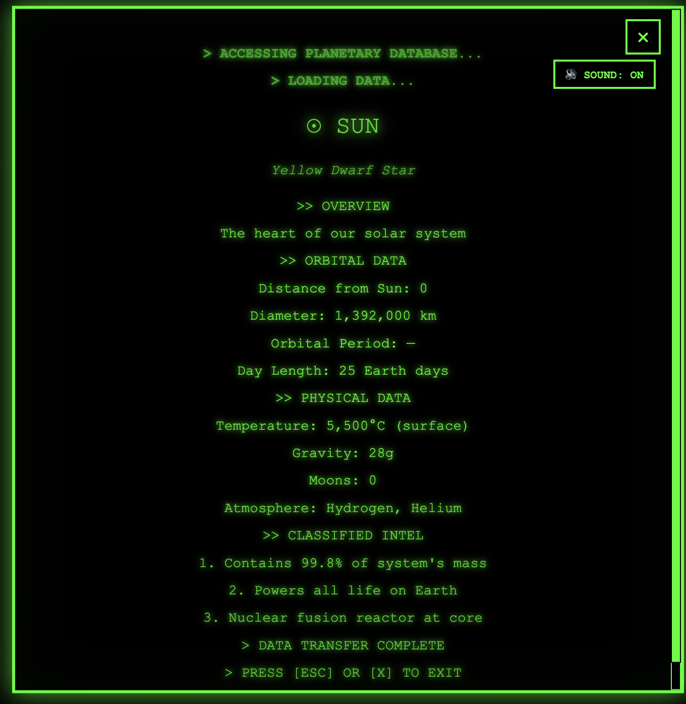
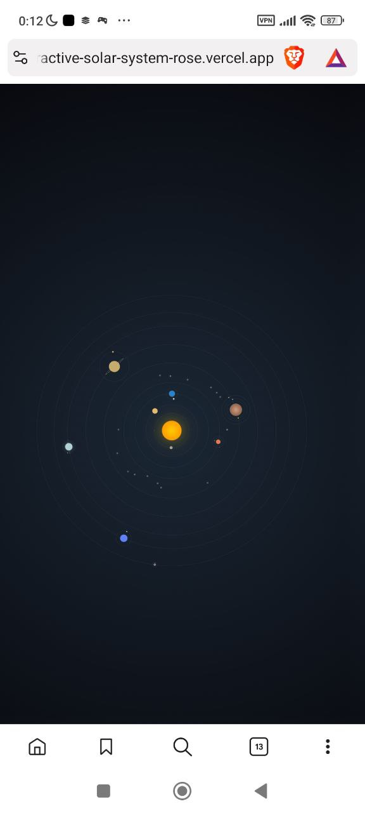

# 🌌 Solar System — Gravity Simulation

<div align="center">


A real-time gravitational physics simulation of the solar system with 20 bodies, orbit trails, time acceleration (1x-200x), and a Fallout 3-style terminal interface.

[🌐 Live Demo](https://laddtnov.xyz/) • [📁 View Code](https://laddtnov.xyz/)
!


</div>

---

## ✨ Features

### 🪐 Planetary System
- **9 Planets + Dwarf Planet** - Mercury through Pluto, all driven by Newtonian gravity
- **10 Natural Satellites** - Moon, Phobos, Deimos, Io, Europa, Ganymede, Titan, Titania, Triton, Charon
- **Real Physics** - Velocity-Verlet integration, solar-centric planet gravity, relative-coordinate moon integration
- **Orbit Trails** - Canvas-drawn trails with alpha fade, plus soft orbit guide circles
- **Time Acceleration** - 1x / 10x / 50x / 200x with adaptive sub-stepping
- **Asteroid Belt** - CSS box-shadow technique (80+ asteroids from 1 DOM element)
- **Planetary Rings** - Jupiter, Saturn, Uranus, and Neptune

### 💚 Fallout 3-Style Terminal
- **Interactive Data Cards** - Click any celestial body to access detailed information
- **Typewriter Effect** - Text types out character-by-character
- **Sound Effects** - Authentic typewriter sounds during text rendering
- **Terminal Interface** - Green monochrome CRT monitor aesthetic
- **Scanlines & Flicker** - Retro computer terminal visual effects

### 📊 Real Astronomical Data
- Orbital periods and distances from the Sun
- Planetary diameters and compositions
- Temperature ranges and atmospheric data
- Gravitational measurements
- Moon counts and orbital characteristics
- Interesting facts and discoveries

### 🎨 Visual Effects
- **Physics-Driven Motion** - All orbits computed by gravitational simulation, not CSS animations
- **Canvas Orbit Trails** - Fading trails with per-segment alpha for depth
- **Star Parallax** - 220-star background responds to mouse movement
- **Glow Effects** - Neon-style hover states on all celestial bodies
- **Responsive Design** - CSS `transform: scale()` at 1024/768/480px breakpoints

### 🔊 Audio Features
- **Typewriter Sound** - 800 Hz square wave on each character
- **Web Audio API** - Synthesized sounds (no external files)
- **Toggle Control** - 🔊/🔇 button to enable/disable sounds
- **Performance Optimized** - Sounds play only when needed

---

## 🚀 Technologies

### Core Technologies
- **HTML5** - Semantic markup, `<canvas>` for orbit trails and star parallax
- **CSS3** - Planet visuals, glow effects, asteroid belt, responsive scaling
  - `will-change: transform` for GPU-composited planet positioning
  - `box-shadow` technique for 80+ asteroids from 1 element
  - Media Queries (1024 / 768 / 480px breakpoints)
- **JavaScript (ES6 Modules)** - Physics engine and all interactivity
  - `<script type="module">` with clean import/export
  - Velocity-Verlet symplectic integration
  - `requestAnimationFrame` loop with adaptive sub-stepping
  - Web Audio API for synthesized sounds
  - Canvas 2D for orbit trails and star parallax

### Physics Engine
- **Gravity model:** Solar-centric (planets feel only Sun's gravity for clean circular orbits)
- **Moon integration:** Relative coordinates (offset from parent) for perfect stability
- **Integrator:** Velocity-Verlet (symplectic, energy-conserving)
- **Adaptive sub-stepping:** `MAX_SUB_DT = 0.012s` ensures Mercury stays accurate even at 200x
- **Softening:** `SOFTENING_SQ = 1` prevents singularities without distorting orbits

### Design Patterns
- **ES module architecture** - 7 focused modules with single responsibilities
- **Immutable vectors** - All `Vector` operations return new instances
- **Flat array trails** - `[x0,y0,x1,y1,...]` ring buffer for memory efficiency

---

## 🎵 Sound System

### Implementation
The project uses **Web Audio API** to generate typewriter sounds programmatically:

```javascript
// Typewriter sound: 800 Hz square wave, 40ms duration
oscillator.frequency.value = 800;
oscillator.type = 'square';
gainNode.gain.setValueAtTime(0.08, ctx.currentTime);
```

### Features
- **Zero dependencies** - No audio files required
- **Instant loading** - Sounds generated on-the-fly
- **Memory efficient** - Minimal resource usage
- **User control** - Toggle button in terminal
- **Smart playback** - Skips spaces, only plays on characters

---

## 📂 Project Structure

```
solar-system-ultimate/
├── index.html              # Flat planet layout + trail canvas + ES module entry
├── styles.css              # Planet visuals, glow, asteroid belt, responsive scaling
├── js/
│   ├── Vector.js           # Immutable 2D vector math (add, sub, scale, mag, norm)
│   ├── data.js             # planetData (display) + bodyConfig (physics) + G constant
│   ├── Body.js             # Celestial body: pos, vel, mass, trail[], DOM element
│   ├── Gravity.js          # Solar-centric accel + Velocity-Verlet + moon integration
│   ├── Simulation.js       # Animation loop, adaptive sub-stepping, trail canvas, HUD
│   ├── ui.js               # Tooltip, Fallout terminal modal, typewriter, sound, parallax
│   └── main.js             # Entry point — wires Simulation + UI + star parallax
├── README.md
└── LICENSE
```

### Module Dependency Graph
```
main.js
├── Simulation.js → Vector.js, Body.js, Gravity.js, data.js
└── ui.js → data.js
```

---

## 🎯 Celestial Bodies

### Inner Solar System
| Body | Diameter | Orbit Period | Moons |
|------|----------|--------------|-------|
| ☉ **Sun** | 1,392,000 km | — | 0 |
| ☿ **Mercury** | 4,879 km | 88 days | 0 |
| ♀ **Venus** | 12,104 km | 225 days | 0 |
| 🜨 **Earth** | 12,742 km | 365 days | 1 |
| ♂ **Mars** | 6,779 km | 687 days | 2 |

### Asteroid Belt
- **Distance:** 329-478 million km from Sun
- **Width:** ~150 million km
- **Composition:** Rock, metal, ice
- **Total Mass:** ~3% of Moon's mass

### Outer Solar System
| Body | Diameter | Orbit Period | Moons |
|------|----------|--------------|-------|
| ♃ **Jupiter** | 139,820 km | 11.9 years | 79 |
| ♄ **Saturn** | 116,460 km | 29.5 years | 82 |
| ♅ **Uranus** | 50,724 km | 84 years | 27 |
| ♆ **Neptune** | 49,244 km | 165 years | 14 |
| ♇ **Pluto** | 2,377 km | 248 years | 5 |

---

## 💻 Installation & Usage

### Quick Start

1. **Clone the repository**
```bash
git clone https://github.com/laddtnov/laddtnov-hub.git
cd interactive-solar-system
```

2. **Open in browser**
```bash
# MacOS
open index.html

# Windows
start index.html

# Linux
xdg-open index.html
```

That's it! No build process, no dependencies. 🎉

### GitHub Pages Deployment

1. Push code to GitHub
2. Go to **Settings → Pages**
3. Select **Deploy from main branch**
4. Access at `https://yourusername.github.io/laddtnov-hub/`

---

## 📱 Responsive Design

### Breakpoints

```css
/* Desktop: Full experience with all features */
Default: 1200x1200px solar system

/* Tablet: Scaled down, optimized asteroids */
@media (max-width: 1024px) {
  .space { transform: scale(0.7); }
}

/* Mobile: Compact layout, minimal asteroids */
@media (max-width: 768px) {
  .space { transform: scale(0.5); }
  .asteroid-belt { opacity: 0.6; }
}

/* Small Mobile: Maximum optimization */
@media (max-width: 480px) {
  .space { transform: scale(0.35); }
}
```

### Adaptive Features
- **Desktop:** Full physics (up to 278 sub-steps), 80+ asteroids, every-frame trails
- **Tablet:** Scaled to 70%, same physics accuracy
- **Mobile:** Sub-steps capped at 150, trails drawn every other frame, battery-efficient
- **Accessibility:** Respects `prefers-reduced-motion`

---

## ⚡ Performance Optimization

### Physics Budget (per frame at 60fps)
| Operation | Cost |
|---|---|
| Gravity + Verlet (20 bodies, adaptive steps) | ~0.5ms |
| Trail canvas (~6000 lineTo calls) | ~0.5ms |
| DOM transforms (20 elements) | ~0.3ms |
| Star parallax (220 arcs) | ~0.2ms |
| **Total** | **~1.5ms** (well under 16ms budget) |

### Adaptive Sub-Stepping
At higher time scales, more physics sub-steps are computed automatically to keep fast inner planets (Mercury ~120 px/s) accurate:
- **1x:** 4 steps/frame
- **10x:** ~14 steps/frame
- **50x:** ~70 steps/frame
- **200x:** ~278 steps/frame (capped at 150 on mobile)

### CSS Optimizations
- **box-shadow technique** - 1 element generates 80+ asteroids (not 80 DOM nodes)
- **will-change: transform** - GPU-composited planet positioning
- **transform over position** - Hardware-accelerated movements

### JavaScript Optimizations
- **Lazy Audio Context** - Initialized only after first user interaction
- **Flat array trails** - `[x0,y0,x1,y1,...]` avoids object allocation
- **Tab visibility API** - Physics pauses when tab is hidden, prevents dt explosion
- **Mobile rendering** - Trail canvas drawn every other frame

---

## 🎨 Customization

### Change Simulation Speed

Edit time scale presets in `js/Simulation.js`:

```javascript
const SPEEDS = [1, 10, 50, 200]   // Available time multipliers
```

### Tune Physics

Edit gravitational constant and body configs in `js/data.js`:

```javascript
export const G = 100              // Gravitational constant (tuned for 1200px canvas)

// Example: add a new planet
{
  id: 'ceres',
  mass: 0.5,
  radius: 4,
  orbitRadius: 230,               // px from Sun
  parent: 'sun',
  domSelector: '.ceres',
  color: '#888888',
  trailMax: 600,
  startAngle: 0,
}
```

### Add New Celestial Bodies

1. Add to `bodyConfig` array in `js/data.js` (physics) and `planetData` object (display info)
2. Add a `<div class="ceres" data-body="ceres"></div>` in `index.html` inside `.space`
3. Add CSS styling in `styles.css`

### Modify Sound Effects

Adjust sound parameters in `js/ui.js`:

```javascript
osc.frequency.value = 800   // Pitch (Hz)
osc.type = 'square'         // Wave: sine, square, sawtooth, triangle
gain.gain.setValueAtTime(0.08, ctx.currentTime)  // Volume (0.0 - 1.0)
```

---

## 🌟 Features Showcase

### Keyboard Controls
| Key | Action |
|---|---|
| `1` `2` `3` `4` | Set speed to 1x / 10x / 50x / 200x |
| `]` or `=` | Speed up |
| `[` or `-` | Slow down |
| `Space` | Pause / Resume |
| `Esc` | Close modal |

### Tooltip System
- Appears on hover over any celestial body (simulation pauses)
- Shows name, subtitle, basic info
- Smart positioning (never goes off-screen)
- Prompt to click for full data

### Terminal Interface
- Fallout 3-inspired green CRT aesthetic
- Typewriter text animation
- Scanlines and screen flicker effects
- Sound toggle button
- ESC or X to close

### Data Display
```
> ACCESSING PLANETARY DATABASE...
> LOADING DATA...

🜨 EARTH
The Blue Planet

>> OVERVIEW
Our home in the cosmos

>> ORBITAL DATA
Distance from Sun: 149.6 million km
Diameter: 12,742 km
Orbital Period: 365.25 days
Day Length: 24 hours

>> PHYSICAL DATA
Temperature: -88°C to 58°C
Gravity: 1.0g
Moons: 1
Atmosphere: N₂, O₂

>> CLASSIFIED INTEL
1. Only known planet with life
2. 71% covered by water
3. Perfect conditions for civilization

> DATA TRANSFER COMPLETE
```

---

## 🛠️ Browser Support

| Browser | Version | Support |
|---------|---------|---------|
| Chrome | 90+ | ✅ Full |
| Firefox | 88+ | ✅ Full |
| Safari | 14+ | ✅ Full |
| Edge | 90+ | ✅ Full |
| Mobile Safari | iOS 14+ | ✅ Full |
| Chrome Mobile | Latest | ✅ Full |

**Note:** Web Audio API requires user interaction to start (browser autoplay policy).

---

## 📸 Screenshots

### Desktop View


### Terminal Interface


### Mobile View


---

## 🗺️ Roadmap

### Completed ✅
- [x] All 9 planets + Pluto
- [x] 10 natural satellites with stable physics
- [x] Asteroid belt (CSS box-shadow technique)
- [x] Planetary rings
- [x] Fallout terminal interface
- [x] Sound effects (Web Audio API)
- [x] Responsive design (4 breakpoints)
- [x] Real astronomical data
- [x] **Gravitational physics simulation** (Velocity-Verlet)
- [x] **ES6 module architecture** (7 modules)
- [x] **Orbit trails** (canvas with alpha fade)
- [x] **Time controls** (1x / 10x / 50x / 200x + pause)
- [x] **Adaptive sub-stepping** (stable at all speeds)
- [x] **Star parallax** (mouse-reactive background)

### Future Ideas 💡
- [ ] Kuiper Belt beyond Neptune
- [ ] Oort Cloud visualization
- [ ] Dwarf planets (Ceres, Eris, Makemake)
- [ ] Spacecraft trajectories (Voyager, New Horizons)
- [ ] Date display (current position calculator)
- [ ] Planet comparison tool
- [ ] Educational mode for schools

---

## 🤝 Contributing

Contributions are welcome! Here's how you can help:

1. **Fork the repository**
2. **Create a feature branch** (`git checkout -b feature/AmazingFeature`)
3. **Commit your changes** (`git commit -m 'Add AmazingFeature'`)
4. **Push to branch** (`git push origin feature/AmazingFeature`)
5. **Open a Pull Request**

### Contribution Guidelines
- Follow existing code style
- Test on multiple browsers
- Update README if adding features
- Optimize for performance
- Maintain accessibility standards

---

## 📝 License

This project is licensed under the MIT License - see the [LICENSE](LICENSE) file for details.

```
MIT License

Copyright (c) 2026 Laddtnov

Permission is hereby granted, free of charge, to any person obtaining a copy
of this software and associated documentation files (the "Software"), to deal
in the Software without restriction, including without limitation the rights
to use, copy, modify, merge, publish, distribute, sublicense, and/or sell
copies of the Software, and to permit persons to whom the Software is
furnished to do so, subject to the following conditions:

The above copyright notice and this permission notice shall be included in all
copies or substantial portions of the Software.
```

---

## 🙏 Acknowledgments

- **Inspiration:** Fallout 3 terminal interface
- **Astronomical Data:** NASA JPL Solar System Dynamics
- **Fonts:** Google Fonts (Orbitron)
- **Icons:** Unicode symbols
- **Sound:** Web Audio API

---

## 📬 Contact

**Laddtnov**
- GitHub: [@laddtnov](https://github.com/laddtnov)
- Email: novytskiyvladislav@proton.me
- Portfolio: [laddtnov.github.io/portfolio-website](https://laddtnov.github.io/portfolio-website/)

---

## 🌠 Project Showcase

Part of the **Cyberpunk Portfolio Collection**:

1. [🌌 Solar System Simulator](https://github.com/laddtnov/css-solar-system-ultimate) - This project
2. [💼 Cyberpunk Portfolio](https://github.com/laddtnov/portfolio-website) - Personal portfolio
3. [📚 Book Tracker](https://github.com/laddtnov/cyberpunk-book-tracker) - Reading tracker

All projects feature **cyberpunk aesthetics** and **modern web technologies**.

---

<div align="center">

### 💚 Built with passion for space and retro-futurism 💚

**Made with ❤️ using HTML, CSS, and JavaScript**

**If you like this project, give it a ⭐!**

[](https://github.com/laddtnov/interactive-solar-system/stargazers)
[](https://github.com/laddtnov/interactive-solar-system/network/members)

</div>
